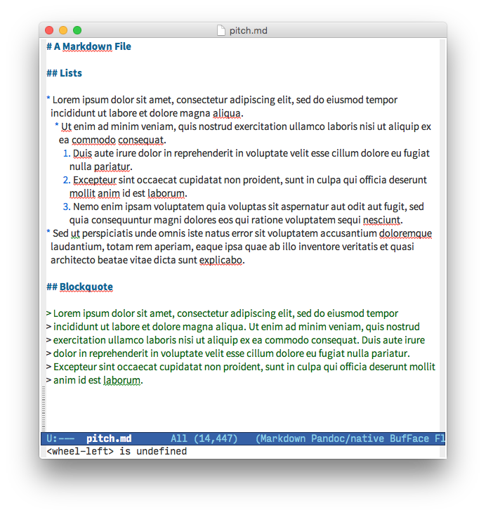
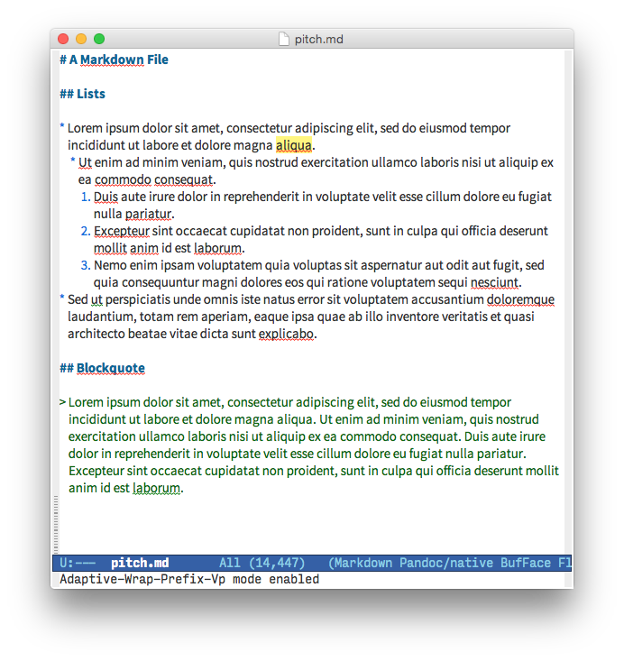

# adaptive-wrap-vp

This is a modification of the `adaptive-wrap-prefix-mode` minor mode for Emacs, tuned to work better with variable-pitch fonts.

## Screenshots

Original `adaptive-wrap-prefix-mode`:

Modified `adaptive-wrap-prefix-vp-mode`:

